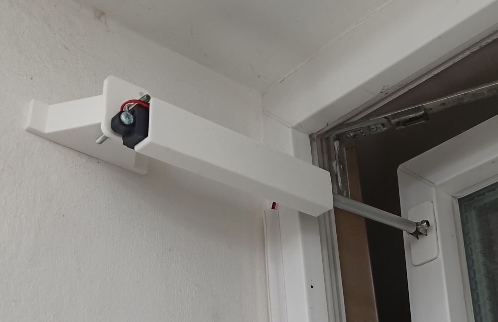

# windowOpener
Open and close your window automatically, to for example, vent your bathroom after showering and then close it when you're away.

# BOM
- 12V linear actuator
- DC-motor driver
- ESP8266 or any other microcontroller
- 12V power supply
- M4 bolts and hex nut
- double sided mounting tape
- attachment and brackets (3D printed)

# 3D printed parts
- windowOpener_brace.stl
- windowOpener_mounitngAdapter.stl
- windowOpener_windowAttachment.stl
- windowOpener_actuatorCover.stl

## printing instructions
I've printed all parts in PLA with 30% infill (brace + mounting plate), no supports, no rafts.

# Electronics
Since the linear actuator has internal limit switches, you will only need to drive the motor cw / ccw and need no additional sensors. This can be done with any microcontroller compatible with your motor controller. 

I chose a Wemos D1 mini (ESP8266 based controller), flashed with TASMOTA. Since the motor controller (I use a L298N-based controller) uses only logic inputs, you will need no driver. 

| Input1 | Input2 | Output |
|--------|--------|--------|
| 1      | 0      | CW     |
| 0      | 1      | CCW    |

Since I do not want to switch two outputs individually, I set up a rule in TASMOTA to toggle both outputs via a third output.

<code>Rule1 ON power3#state=0 DO backlog power1 off; power2 off; power2 on endon</code>  
<code>Rule2 ON power3#state=1 DO backlog power1 off; power2 off; power1 on endon</code>  
<code>rule1 on</code>  
<code>rule2 on</code>

This will lead to the desired output:
| Power3 | Power1 | Power2|
|--------|--------|--------|
| 0      | 0      | 1     |
| 1      | 1      | 0     |

I only need to set power3 via MQTT and then Power1 and Power2 are set accordingly. 

